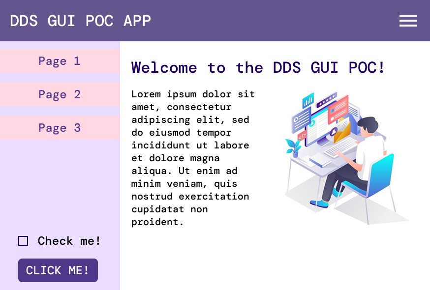
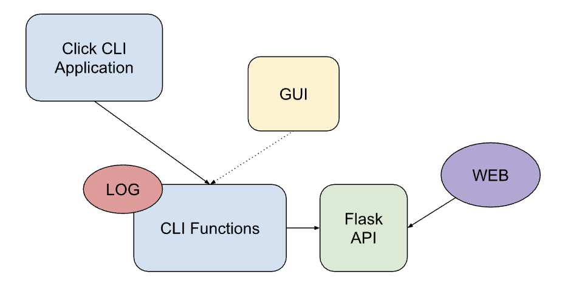

# DDS GUI POC

## Goal

1. Investigate the use of PyQt6 and Textualize to create a GUI for the DDS.
2. Create a mock up of a GUI using the chosen library.

### Main Criterias for the GUI Framework/Library

- Easy to understand and use 
- Easy to maintain 
- Good documentation and community support

## GUI Framework/Library

### Choosing the GUI Framework/Library

During discussions the following libraries were considered:

- PyQt6
- Textualize
- Other python based GUI frameworks (tkinter, kivy, pyside6, etc.)
<!--- Web development frameworks (Electron, Tauri, Flutter, etc.)-->    

Pros and cons between the different python based GUI/TUI frameworks are derived from the following articles:

- [Python GUI : Difference between tkinter, PyQt, and Kivy](https://medium.com/@qasim.coder/python-gui-smackdown-unleashing-the-power-of-tkinter-pyqt-and-kivy-e7b05d0e862)
- [PyQt vs. Tkinter — Which Should You Choose for Your Next GUI Project?](https://www.pythonguis.com/faq/pyqt-vs-tkinter/)
- [Best Python GUI Libraries](https://www.bairesdev.com/blog/best-python-gui-libraries/)
- [PyQt5 vs PySide2](https://www.pythonguis.com/faq/pyqt5-vs-pyside2/)
- [Desktop App Development - PyQt vs Tkinter vs Electron](https://apfirebolt.hashnode.dev/desktop-app-development-pyqt-vs-tkinter-vs-electron)


| Library | Best For | Pros | Cons | Licencing |
|---------|------|------|------|------|
| PyQt6 | Desktop applications, multimedia, scientific, and engineering applications | Feature rich, extensive documentation, active community support | Larger and  more complex, supposedly a steeper learning curve | GPL   
| Textualize | CLI integration | Can be served as an web application, low requirments | Might still feel like a CLI application for end users | MIT
| tkinter | Simple GUIs, small portable applications | Simple and standardized, already included in python | Limited UI, looks outdated out of the box, needs multiple dependencies to look modern, lacks more complex features | Python
| kivy | Mulit platform applications (both mobile and desktop) | Support for touch and gesture interfaces| Smaller community, less mature, less documentation | MIT
| pyside6 | Same as PyQt6 | Same as PyQt6 | Same as PyQt6 | LGPL

Going forward with PyQt6 and Textualize.

## Prototype 

Design file used to test the libraries:



**Disclaimer:** The design file will not represent a "good" use of the different libraries, as some are less flexible and some are more complex than others. The design file is only ment as a guide for testing out the libraries, hence the different implementations will not all look like the design file.

However, if a UI library is easy to customize and style accoring to predecided UX/UI guidelines, it will be easier to maintain and update the UI and a plus in the comparison.

## PyQt6

### Installation

```bash
pip install PyQt6
``` 

### Running the application

```bash
python pyqt/app.py
```

### Comments
- Documentation for PyQt6 was generally hard to navigate and understand.
- Using the widgets was relatively straight forward.
- The styling was a bit more difficult to understand.
- Final code has good readability (better than tkinter for example, in my opinion)
- Feels possible to make a nice looking UI with PyQt6


## Textualize

### Installation

```bash
pip install textual
```

### Running the application

```bash
python textualize/app.py
```
### Comments
- Documentation is good and easy to understand and navigate
- The default widgets are easy to implement
- No support for images
- No support for changing font size and font type
- Not meant to be used as a "web looking" UI, more of a clickable CLI
- Limited customization options of the default widgets

# POC on Auth commands with GUI

## DDS CLI 

### Current setup
Currently no return of the API respone from the middle layer is implemented. Want to make the response availible for the GUI. 



Want to either:
- Move the logging to the click application and make the cli functions return the API response, or
- Keep the logging in the cli functions but make the fuction return the API response

### Example of current implementation

```python
# -- dds user info -- #
@user_group_command.command(name="info")
# Options
# Flags
@click.pass_obj
def get_info_user(click_ctx):
    """Display information connected to your own DDS account.

    Usable by all user roles.

    \b
    The following information should be displayed:
    - Username
    - Role
    - Name
    - Primary email
    - Associated emails (not useful yet)
    """
    try:
        with dds_cli.account_manager.AccountManager(
            no_prompt=click_ctx.get("NO_PROMPT", False),
            token_path=click_ctx.get("TOKEN_PATH"),
        ) as get_info:
            get_info.get_user_info()
    except (
        dds_cli.exceptions.APIError,
        dds_cli.exceptions.AuthenticationError,
        dds_cli.exceptions.DDSCLIException,
        dds_cli.exceptions.ApiResponseError,
        dds_cli.exceptions.ApiRequestError,
    ) as err:
        LOG.error(err)
        sys.exit(1)
```

```python
def get_user_info(self):
        """Get a users info."""
        response, _ = dds_cli.utils.perform_request(
            dds_cli.DDSEndpoint.DISPLAY_USER_INFO,
            headers=self.token,
            method="get",
            error_message="Failed to get user information",
            timeout=dds_cli.DDSEndpoint.TIMEOUT,
        )

        for field in response.get("info", []):
            if isinstance(response["info"][field], str):
                response["info"][field] = rich.markup.escape(response["info"][field])

        info = response.get("info")
        if info:
            LOG.info(
                "Username:          %s \n"
                "Role:              %s \n"
                "Name:              %s \n"
                "Primary Email:     %s \n"
                "Associated Emails: %s \n",
                info["username"],
                info["role"],
                info["name"],
                info["email_primary"],
                ", ".join(str(x) for x in info["emails_all"]),
            )
```

### Comments 

- For some cli functions it's enough to just add a return statement in the method
- The authentication would need to be either reformated or adding a parallel authentication for the gui --> could be a better solution to rewrite the authenticatin flow all together 
- **Problem**: In the current auth flow the sign in and 2fa are done in the same method. and the input of text in the cli are happening inside the method. The GUI solution need the login and 2fa to be seperate methods.
- **Possible Solution**: Try to split up the methods in auth class to smaller methods so the gui can call them.

## Widgets

### PyQt6

Pyqt6 includes many different widgets that is useful for the DDS GUI. A demo (unstyled) of the different widgets is availible through:

``` bash
python pyqt/widgets.py
```

For documentation of all widgets, visit: [Qt documentation](https://doc.qt.io/qtforpython-5/PySide2/QtWidgets/index.html#module-PySide2.QtWidgets) (this is acctually documentation for the PySide2 widgets but they should be the same) or [Pyqt widget](https://www.tutorialspoint.com/pyqt/pyqt_basic_widgets.htm).


### Textualize 
 
 All textualize widgets can be found in their [widget gallery](https://textual.textualize.io/widget_gallery/).

